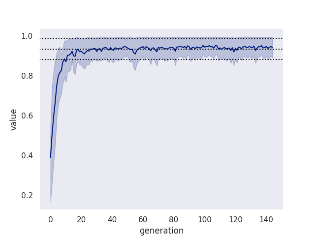
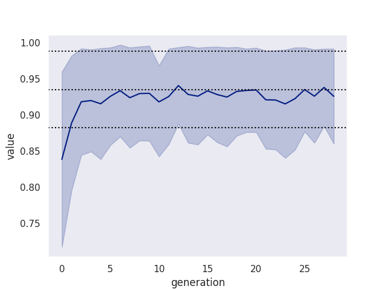

## Motivation

Computer vision models have been around for a good while with great,
high-stakes industrial use cases ranging from agriculture to privacy threatening
surveillance. I sought to find a low-stakes non-commercial everyday use case
that directly impacts a person, hoping to make these models more ubiquitous
and boring.

## Problem Statement

My gallery remains a cluttered, horribly unorganised mess. A mix of screenshots,
art, portraits and what not. I would love them to be neatly organized in
directories.

We generalize this to be: organize a set of images into a user-defined set of directories.

**Constraint**: There shouldn't be a need to go through a special UI to define the categories.

**Constraint**: A raspberry pi 5 with no gpu should be enough to execute the solution.

**Constraint**: It shouldn't take more an than hour to get system running.

**Target audience**: We will be less ambitious here and target a typical HomeLab owner.


## YOLO-CLS

Ultralytics graciously provides YOLOvN-cls models for classifiction problems,
and also provides pretrained weights for those models. A perfect base to then
personalize over.

However, how many images do we need to train our model over until it gets good
enough to be left alone? How much manual labor is needed until the model becomes
self-sufficient?

But before that, let's define how our solution would look like.


## Interface

To keep it simple, we will keep the interface spiritually akin to:
```bash
jibril images/
```

where the `images/` directory is organized by the user as:
```
images
├── category0
│   ├── image0.png
│   ├── image1.png
│   └── image2.png
├── category1
│   ├── image0.png
│   ├── image1.png
│   └── image2.png
├── category2
│   ├── image0.png
│   ├── image1.png
│   └── image2.png
├── uncategorized-image0.png
├── uncategorized-image1.png
├── uncategorized-image2.png
└── uncategorized-image3.png
```

And jibril is essentially a function that moves images under `images/` to the
appropriate `category` directory, running as a daemon.

Additionally, nature of each image and category is unknown.

Each category _must_ have _some_ images to act as "seeds".

Finally, jibril will create a `_unsure` directory to keep the images where its
not confident enough with its classification.


## Training Strategy

Coming back to the questions laid out earlier, how many images should each
category have for training the model before it becomes effective.

Should the user manually categorize at least a hundred images before reaching
out for jibril? Or perhaps we can train our model over just a handful of images,
then predict, ask the user for guidance, retrain, then repeat?

If we take the latter approach, how many iterations will it take before the
model becomes self-sufficient and won't need as much hand holding.

The latter approach fits our constraint for setup time. 

### Bulk Training

This is your run of the mill strategy where you categorize a large number of
samples ahead of time and train over them with however many epochs, ending with
a model that's good enough.

You train once, and are done. Add more samples if you are not happy with the
fitness. Finally deploy and profit.

This will serve as our benchmark.

### Generational Training

To reduce the setup time we start with a small set of samples per category, say
1, 2 or 5. Then get into the following loop:

```python
while True: # can be a cron job
    # will be the seed images on the very first iteration
    train_over_images() 

    # start with a small number, grow with each iteration
    categorize_some_images()

    # could be as simple as just moving the images across directories
    let_human_fix_miscategorized_images()  
```

The big idea being that the manual labor will be amortized over multiple
"generations", and over time the number of images requiring human intervention
will tend toward zero.

The bookkeeping needed to avoid over fitting with training, and the signalling
needed for interaction with the human are implementation details that we will
address later.


## Validation

To validate our idea and putting down some concrete numbers for the generations
needed, we run a simulation to speedrun through multiple generations and then
compare against a baseline. We use `imagewoof` for a slight challenge.

For each generation, we expose the model to a small but growing subset of the
original dataset. Then the bulk dataset is just a keyed union of all generation.

The code for this simulation is available at: https://github.com/keogami/yolo-research

For understanding, given a single category with the following train/test split and a desired `batch` size of 2:
```
train: [1, 2, 3, 4, 5]
test: [6, 7, 8, 9, 10]

we produce three generations:
gen0: {
    train: [1, 2]
    test: [6, 7]
}
gen1: {
    train: [3, 4]
    test: [6, 7, 8, 9]
}
gen2: {
    train: [5]
    test: [6, 7, 8, 9, 10]
}
```

**Note**: We are cummulating the test split to reinforce patterns.

**Note**: We are not cummulating the train split to avoid overfitting.

Practically, The `batch` variable will be random and vary with each generation
but in our simulations we can try multiple `batch` to find a correlation between
it and the generations needed to reach baseline.

Finally, as our metric we use the typical `top1`, `top5`, and `fitness` metrics
provided by YOLO when running validation against a completely separate set that
the model hasn't been exposed to.


## Results

Running our simulation over the images `imagewoof/train`, with `batch = 1` we
get the following graph:



The top, middle, and bottom dotted line shows the `top5`,`fitness`, and `top1`
of our bulk training respectively. The thick line show the `fitness` of each
generation.

Here we note that:
1. Model sucks ass during the initial generations
2. Then eventually catches up with the baseline
3. However, it takes ~18 generations to catch up
4. The generations plateau out rather quickly


Running it again with `batch = 5` and the exact same set gets the following
graph:



Here we note that:
1. Model sucks less than `batch=1` during initial generations
2. It catches much faster, after ~6 generations
3. The generations plateau even quicker

---

### Aside

Another fact that this exercise brought to surface is that training in loop
really kills the memory, eating over 32Gigs of ram despite the training being
offloaded to my AMD GPU. Running `memray` showed that most memory was consumed
by the `model.train()` routine. This would easily become a non-starter for
raspberry pi constraint. This will dictate our next steps.


## Conclusion and Next Steps

We can be a lot more thorough with our analysis, eliminate more variables, try a
harder image set then imagewoof, etc; but these results affirm my confirmation
bias and are "good enough" for me, and give me enough confidence to continue.
But feel free to give the simulation code a couple runs and/or challenging the
premise altogether.

Next steps would be try and reduce the memory footprint for this iterative
training. I am gonna try out the `ort` crate in rust, compare the results with
yolo's pytorch impl. Why rust? more control over memory and familiarity bias :P
